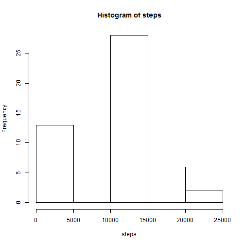
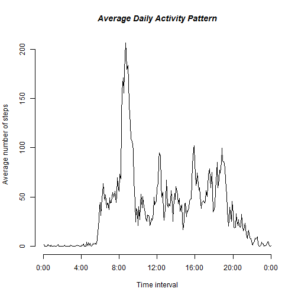
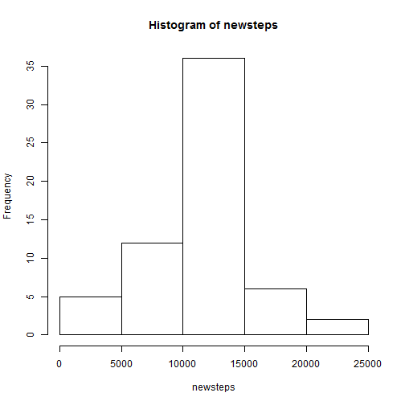
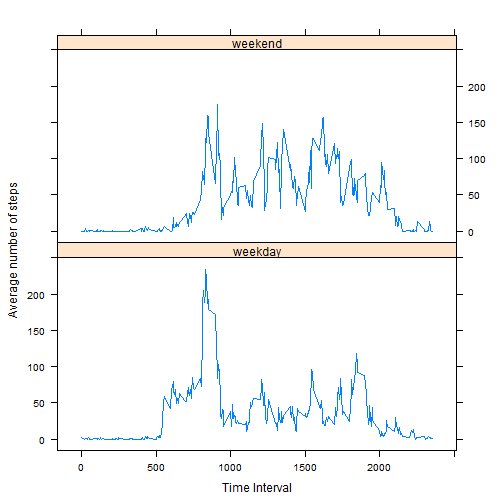

# Reproducible Research: Peer Assessment 1

This assignment makes use of data from a personal activity monitoring device.

## Loading and preprocessing the data

First we load the data and do some preprocessing to compute the number of steps per day


```r
data <- read.csv("activity.csv")

stepsperday <- function(s1) {
    days <- levels(data[, 2])
    
    isna <- is.na(s1)
    d1 <- data[, 2]
    s2 <- s1[!isna]
    d2 <- d1[!isna]
    
    ## x <- sapply(split(st,da), sum)
    v <- vector(mode = "numeric", length = 61)
    i <- 1
    for (d in days) {
        isd <- d2 == d
        sk <- s2[isd]
        v[i] <- sum(sk)
        i <- i + 1
    }
    
    v
}
steps <- stepsperday(data[, 1])
```


## What is mean total number of steps taken per day?

We analyze the number of steps taken per day. For this analysis, we ignore any missing values in the data set.


```r
hist(steps, breaks = 5)
```

 

```r
mean <- mean(steps)
median <- median(steps)
```


Mean number of steps per day:    9354.2295

Median number of steps per day:  1.0395 &times; 10<sup>4</sup>


## What is the average daily activity pattern?


We break a day into 5-minute periods and we want to analyze the average daily activity pattern.


```r
s1 <- data[, 1]
ndays <- length(s1)/288
m1 <- matrix(data = s1, nr = 288, nc = ndays)
rm <- rowMeans(m1, na.rm = TRUE)

plot(rm, type = "l", xlab = "Time interval", ylab = "Average number of steps", 
    axes = FALSE)
axis(1, c(0, 48, 96, 144, 192, 240, 288), labels = c("0:00", "4:00", "8:00", 
    "12:00", "16:00", "20:00", "0:00"))
axis(2, c(0, 50, 100, 150, 200), labels = c("0", "50", "100", "150", "200"))
title("Average Daily Activity Pattern", font.main = 4)
```

 

```r

mx <- max(rm)
mp <- which.max(rm)
hour1 <- floor(mp/12)
hour2 <- hour1
min1 <- (mp%%12) * 5
min2 <- min1 + 5
if (min2 >= 60) {
    min2 <- min2 - 60
    hour2 <- hour1 + 1
}
starttime <- paste(as.character(hour1), as.character(min1), sep = ":")
endtime <- paste(as.character(hour2), as.character(min2), sep = ":")
```


We can see that the maximum average number of steps is 206.1698 and this occurs at position 104, which corresponds to the time interval from 8:40 to 8:45.


## Imputing missing values

The data contains many missing values.


```r
isna <- is.na(data[, 1])
l1 <- length(data[, 1])
s2 <- s1[!isna]
l2 <- length(s2)
numNA <- l1 - l2
```


The number of missing values is 2304

We choose to replace the missing values by the mean for the corresponding time period.


```r
newdata <- data[, 1]
for (i in 1:length(newdata)) {
    if (is.na(newdata[i])) {
        newdata[i] <- rm[((i - 1)%%288) + 1]
    }
}

newsteps <- stepsperday(newdata)
```


We plot and find the mean and median of the new data with the missing values replaced.


```r
hist(newsteps, breaks = 5)
```

 

```r
newmean <- mean(newsteps)
newmedian <- median(newsteps)
```


New mean number of steps per day:    1.0766 &times; 10<sup>4</sup>

New median number of steps per day:  1.0766 &times; 10<sup>4</sup>

As expected, as a result of the replacement, the mean and median have increased. The number of days with 0 steps has dropped significantly.


## Are there differences in activity patterns between weekdays and weekends?

We separate the data from weekdays and weekends. We then plot the average number of steps per day separately for the two categories.


```r
wd <- vector(mode = "character", length = length(data[, 2]))
lv <- vector(mode = "logical", length = length(data[, 2]))
for (i in 1:length(data[, 2])) {
    d <- weekdays(as.Date(data[i, 2]))
    if (d == "Monday") {
        wd[i] <- "weekday"
        lv[i] <- TRUE
    } else if (d == "Tuesday") {
        wd[i] <- "weekday"
        lv[i] <- TRUE
    } else if (d == "Wednesday") {
        wd[i] <- "weekday"
        lv[i] <- TRUE
    } else if (d == "Thursday") {
        wd[i] <- "weekday"
        lv[i] <- TRUE
    } else if (d == "Friday") {
        wd[i] <- "weekday"
        lv[i] <- TRUE
    } else if (d == "Saturday") {
        wd[i] <- "weekend"
        lv[i] = FALSE
    } else if (d == "Sunday") {
        wd[i] <- "weekend"
        lv[i] = FALSE
    }
}

s1 <- data[, 1]
weekday1 <- s1[lv]
weekend1 <- s1[!lv]

s1 <- data[, 1]
ndays <- length(s1)/288
wm1 <- matrix(data = weekday1, nr = 288, nc = length(weekday1)/288)
wm2 <- matrix(data = weekend1, nr = 288, nc = length(weekend1)/288)
rm1 <- rowMeans(wm1, na.rm = TRUE)
rm2 <- rowMeans(wm2, na.rm = TRUE)
rm3 <- vector(mode = "numeric", length = 288 * 2)
intv <- vector(mode = "integer", length = 288 * 2)
dowv <- vector(mode = "character", length = 288 * 2)
for (i in 1:288) {
    dowv[i] <- "weekday"
    tmp <- (i - 1) * 5
    htmp <- floor(tmp/60)
    mtmp <- tmp%%60
    intv[i] <- htmp * 100 + mtmp
    rm3[i] <- rm1[i]
}
for (i in 1:288) {
    dowv[i + 288] <- "weekend"
    rm3[i + 288] <- rm2[i]
    tmp <- (i - 1) * 5
    htmp <- floor(tmp/60)
    mtmp <- tmp%%60
    intv[i + 288] <- htmp * 100 + mtmp
}

library(lattice)
df <- data.frame(avgstep = rm3, intervals = intv, dow = dowv)
xyplot(avgstep ~ intervals | dow, data = df, layout = c(1, 2), type = "l", xlab = "Time Interval", 
    ylab = "Average number of steps")
```

 


We can see that there is a lot of difference between weekday and weekend activity patterns.

